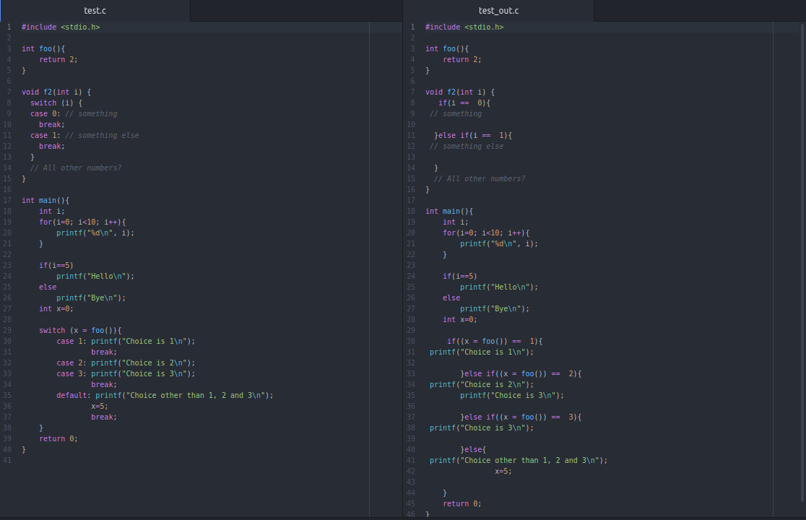

# Switcheroo
Source-to-source transformation of every switch-case statement to an if-else statement using Clang as a library.
* *input:* source code written in C
* *output:* a C program that has every switch statement converted into if-else statements

## Installation guide
In order to use this tool you must have LLVM and Clang installed on your system. You can do so by following this [tutorial](https://clang.llvm.org/docs/LibASTMatchersTutorial.html) from the LLVM/Clang official website.

*Notes:*
* If you are having crashes during the installation, try using cmake with a `-DCMAKE_BUILD_TYPE=Release` flag since the default flag is `Debug` which tends to require a lot of disk space which might be the cause of the crash.
* Part of the tutorial about installing cmake is a bit out of date but you can just install it using the `apt-get cmake` command.

## Adding the tool
After successfully installing LLVM and Clang, follow the rest of the tutorial to see how to create a directory in which you will save your tool and how to run the tool on your desired source file.
